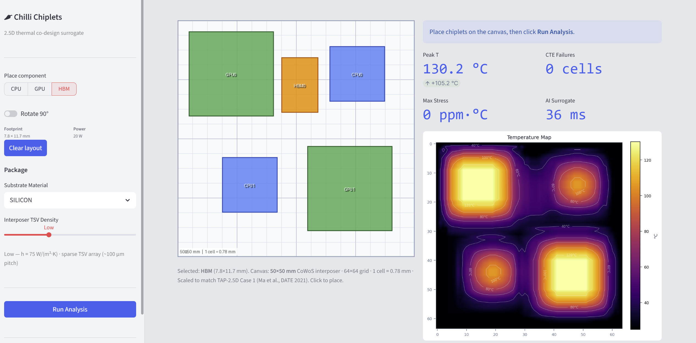
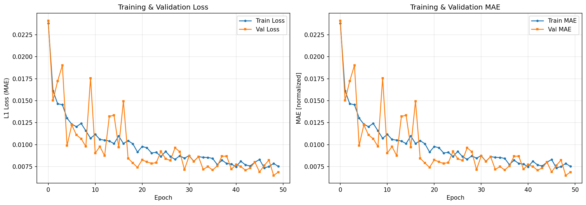

# Chili Chiplets — AI Thermal Surrogate for 2.5D Heterogeneously Integrated Microelectonics

> **Winner of Devices, Process Flow, Models & Packaging track** — Microsystems Technology Laboratories (MTL) Hackathon 2026 at MIT | [Pitch Presentation](supplementary_info/Chili%20Chiplets%20presentation.pdf)

An interactive EDA tool that predicts steady-state thermal distribution across a 2.5D chiplet layout in **milliseconds**, replacing multi-hour finite-element simulations during early co-design.



---

## The Problem

Advanced 2.5D packaging (e.g., TSMC CoWoS) suffers from thermal crosstalk and CTE mismatch between dies and substrate. Traditional FEM thermal solvers take **24+ hours**, making iterative design exploration impractical. Engineers need instant feedback on layout, material, and cooling decisions before taping out.

## The Solution

A CNN surrogate trained on synthetic FDM data that:
- Predicts full 64×64 temperature heatmaps in **milliseconds**
- Covers substrate material choice (Silicon vs. AlN) and TSV cooling density
- Overlays CTE shear stress flags automatically
- Lets engineers place dies interactively and see thermal consequences in real time

---

## System Architecture

```
data_generator.py   →   model_trainer.py   →   app.py
  (FDM physics)          (CNN training)        (Streamlit UI)
```

| Component | Description |
|---|---|
| `data_generator.py` | NumPy FDM solver. Generates 2000 synthetic 2.5D layouts and solves the 2D Poisson equation for steady-state heat. Saves `X_data.npy`, `Y_data.npy`, and `readme.txt`. |
| `model_trainer.py` | PyTorch CNN (encoder-decoder). Takes 3-channel input (Power Q, Conductivity k, Cooling h) and predicts a 64×64 temperature map. |
| `app.py` | Streamlit dashboard. Interactive chiplet placement, real-time AI inference, physics engine comparison, and CTE stress overlay. |
| `visualize_model_predictions.py` | Standalone script to generate fresh FDM samples and compare AI vs ground truth. |

---

## Quick Start

### 1. Install dependencies

```bash
pip install -r requirements.txt
```

> Requires Python 3.10+. GPU (CUDA) is optional — CPU works fine for inference.

### 2. Run the app (pre-trained model included)

The trained model weights (`thermal_surrogate.pth`) are included in the repo. You can run the app immediately without retraining:

```bash
streamlit run app.py
```

### 3. (Optional) Regenerate training data

```bash
python data_generator.py
```

This generates `X_data.npy`, `Y_data.npy`, and `readme.txt` with normalization constants. Takes ~2–5 minutes for 2000 samples.

### 4. (Optional) Retrain the model

```bash
python model_trainer.py
```

Trains for 50 epochs on `X_data.npy` / `Y_data.npy`. Saves `thermal_surrogate.pth` and `training_loss.png`. Takes ~5–10 minutes on CPU, ~1 minute on GPU.

### 5. (Optional) Evaluate predictions

```bash
python visualize_model_predictions.py --count 4 --seed 42
```

---

## Using the App

1. **Place dies** — Click the canvas to place Logic dies (CPU/GPU) or Memory blocks. Use the sidebar to select component type. Toggle "Rotate 90°" for landscape orientation.
2. **Configure substrate** — Choose Silicon or Aluminum Nitride (AlN). AlN has higher conductivity but triggers CTE mismatch flags.
3. **Set cooling** — Select TSV density (None / Low / Medium / High).
4. **Read the heatmap** — The temperature map updates instantly via AI inference. CTE stress regions are flagged in red.
5. **Validate** — Go to the Validation tab and click "Compare AI vs Physics" to run the FDM solver and compare both outputs side by side.
6. **Physics mode** — Toggle "Switch to physics engine mode" in the sidebar to always use FDM instead of the CNN.

---

## Validation

### AI surrogate vs. physics engine

The primary validation is the agreement between the AI surrogate and our own FDM solver on the same layout:

| Solver | Peak Temperature |
|---|---|
| Our FDM engine | 135°C |
| Our AI surrogate | 130°C |

The ~5°C peak difference is consistent with the training MAE of **2.2°C** averaged across all 4,096 cells.

### Comparison to TAP-2.5D benchmark

Running the TAP-2.5D Case 1 layout (Multi-GPU system) through our engine gives **135°C** vs. the paper's HotSpot result of **95.3°C**. The ~40°C gap is expected — our FDM is a 2D single-layer solver with simplified boundary conditions, while HotSpot models a full 3D stack (die, TIM, heat spreader, substrate, PCB) with measured material properties. The comparison demonstrates where a higher-fidelity solver would be needed, and motivates future work on 3D thermal modelling.

### Training curves



Val MAE converges to ~0.008 (normalized) = **~2.2°C** absolute across the full heatmap.

---

## Physics

The FDM solver uses the discrete 2D Poisson approximation for steady-state heat:

```
T[i,j] = 0.25 * (T[i-1,j] + T[i+1,j] + T[i,j-1] + T[i,j+1]) + Q[i,j] / k[i,j]
```

The 3-channel input encodes:
- **Channel 0 — Q** (W/cell): Power density at each grid cell
- **Channel 1 — k** (W/m·K): Substrate thermal conductivity (Si=149, AlN=260)
- **Channel 2 — h** (W/m²·K): Convective cooling coefficient (ambient + TSVs)

CTE mismatch stress is computed post-inference:
```
Stress = |CTE_chip - CTE_substrate| × (T_predicted - T_ambient)
```
Flag threshold: 150 ppm·°C.

---

## Data Format

| File | Shape | Description |
|---|---|---|
| `X_data.npy` | (2000, 3, 64, 64) | Normalized input: Power, k, h |
| `Y_data.npy` | (2000, 64, 64) | Normalized temperature labels |

All values are min-max normalized to [0, 1]. See `readme.txt` for exact normalization constants.

---

## References

- Romano, G., Jain, A., Dehmamy, N., Chi, C., & Zhang, X. *DiffChip: Thermally Aware Chip Placement with Automatic Differentiation*. arXiv:2502.16633, 2025.
- Ma, Y., Delshadtehrani, L., Demirkiran, C., Abellán, J. L., & Joshi, A. *TAP-2.5D: A Thermally-Aware Chiplet Placement Methodology for 2.5D Systems*. DATE 2021.
- Graening, A., Gupta, P., Kahng, A. B., Pramanik, B., & Wang, Z. *ChipletPart: Cost-Aware Partitioning for 2.5D Systems*. arXiv:2507.19819, 2025.
- Chen, S., Li, S., Zhuang, Z., Zheng, S., Liang, Z., Ho, T.-Y., Yu, B., & Sangiovanni-Vincentelli, A. L. *Floorplet: Performance-aware Floorplan Framework for Chiplet Integration*. arXiv:2308.01672, 2023.
- Sharma, M. K., & Ramos-Alvarado, B. *Thermal Management of 3-D Heterogeneously Integrated Microelectronics: Challenges and Future Research Directions*. Communications Engineering (Nature Portfolio), 2026.
- Huang, W. et al. *HotSpot: A Compact Thermal Modeling Methodology for Early-Stage VLSI Design*. IEEE TVLSI 2006.

## Acknowledgement
- Would like to thank MTL and event organizers for organizing the event and teammates Brian and Dinish for the effort in the hackathon.
